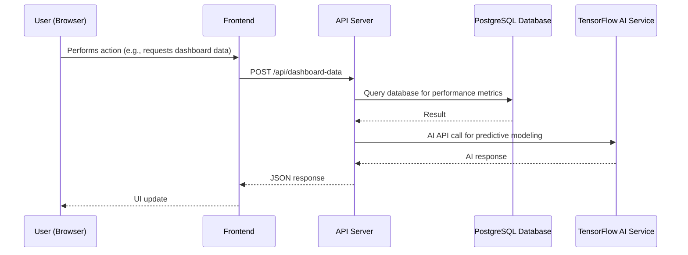
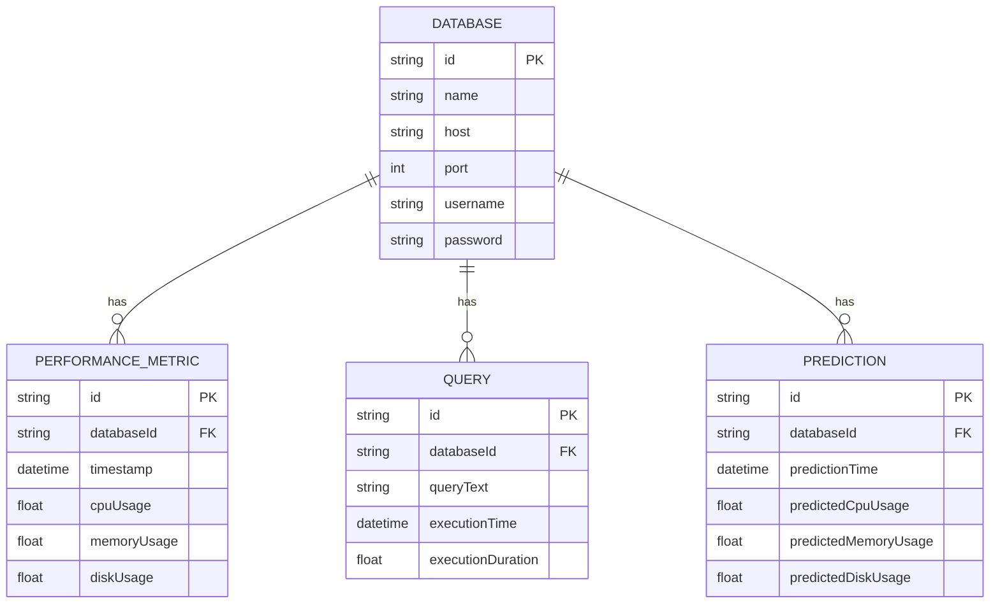

# PostgreSQL Observability Dashboard
### MVP Architecture Document
> **Team:** talha · **Duration:** 12 weeks · **Stack:** Python, PostgreSQL, TensorFlow

---

## 1. Executive Summary
The PostgreSQL Observability Dashboard is a comprehensive platform designed to provide database administrators with a centralized interface for visualizing and analyzing PostgreSQL database performance metrics. This dashboard aims to address the common challenges faced by database administrators in identifying bottlenecks and optimizing query performance. By leveraging the capabilities of Python, PostgreSQL, and TensorFlow, this project will enable advanced analytics and predictive modeling, allowing users to anticipate and prevent performance issues.

The PostgreSQL Observability Dashboard will offer a user-friendly interface for exploring and analyzing database performance data, including query execution times, lock contention, and disk usage. The dashboard will also provide features for predictive modeling, enabling users to forecast potential performance issues and take proactive measures to prevent them. With its robust analytics and predictive capabilities, the PostgreSQL Observability Dashboard will empower database administrators to make data-driven decisions and optimize database efficiency.

The primary challenge addressed by this project is the lack of a comprehensive observability tool for PostgreSQL databases. Existing solutions often require significant setup and configuration, making them inaccessible to many users. The PostgreSQL Observability Dashboard will fill this gap by providing a straightforward and intuitive interface for database administrators to monitor and analyze database performance.

## 2. System Architecture Overview

### 2.1 High-Level Architecture Diagram
```
┌─────────────────────────────────┐
│         React / Next.js         │  
└────────────┬────────────────────┘
             │ HTTPS / REST
┌────────────▼────────────────────┐
│      Express.js API Server      │
│  ┌──────────┐  ┌─────────────┐  │
│  │  Routes  │  │  Middleware │  │
│  └──────────┘  └─────────────┘  │
│  ┌──────────────────────────┐   │
│  │     Service Layer        │   │
│  └──────────────────────────┘   │
└───┬──────────────┬──────────────┘
    │              │
┌───▼───┐    ┌─────▼──────┐
│PostgreSQL│    │ TensorFlow  │
│ Database │    │  AI Service  │
└───────┘    └────────────┘
```

### 2.2 Request Flow Diagram (Mermaid)


### 2.3 Architecture Pattern
The PostgreSQL Observability Dashboard will follow a layered architecture pattern, consisting of a presentation layer (React/Next.js), an application layer (Express.js API Server), a service layer, and a data access layer (PostgreSQL Database). This pattern is suitable for this project due to its simplicity and maintainability, allowing for a clear separation of concerns and easy extension of features.

### 2.4 Component Responsibilities
The presentation layer (React/Next.js) will be responsible for rendering the user interface and handling user input. The application layer (Express.js API Server) will handle API requests, interact with the service layer, and return responses to the presentation layer. The service layer will encapsulate the business logic of the application, including data processing and predictive modeling. The data access layer (PostgreSQL Database) will be responsible for storing and retrieving data.

## 3. Tech Stack & Justification

| Layer | Technology | Why chosen |
|-------|-----------|------------|
| Frontend | React/Next.js | Popular and well-maintained framework for building user interfaces |
| API Server | Express.js | Lightweight and flexible framework for building RESTful APIs |
| Database | PostgreSQL | Robust and feature-rich relational database management system |
| AI Service | TensorFlow | Popular and widely-used open-source machine learning library |

## 4. Database Design

### 4.1 Entity-Relationship Diagram


### 4.2 Relationship & Association Details
The relationship between the DATABASE entity and the PERFORMANCE_METRIC entity is one-to-many, as a database can have multiple performance metrics. The relationship between the DATABASE entity and the QUERY entity is also one-to-many, as a database can have multiple queries. The relationship between the DATABASE entity and the PREDICTION entity is one-to-many, as a database can have multiple predictions.

### 4.3 Schema Definitions (Code)
```python
from sqlalchemy import Column, Integer, String, Float, DateTime, ForeignKey
from sqlalchemy.orm import relationship

class Database(Base):
    __tablename__ = 'databases'
    id = Column(Integer, primary_key=True)
    name = Column(String)
    host = Column(String)
    port = Column(Integer)
    username = Column(String)
    password = Column(String)
    performance_metrics = relationship('PerformanceMetric', backref='database')
    queries = relationship('Query', backref='database')
    predictions = relationship('Prediction', backref='database')

class PerformanceMetric(Base):
    __tablename__ = 'performance_metrics'
    id = Column(Integer, primary_key=True)
    database_id = Column(Integer, ForeignKey('databases.id'))
    timestamp = Column(DateTime)
    cpu_usage = Column(Float)
    memory_usage = Column(Float)
    disk_usage = Column(Float)

class Query(Base):
    __tablename__ = 'queries'
    id = Column(Integer, primary_key=True)
    database_id = Column(Integer, ForeignKey('databases.id'))
    query_text = Column(String)
    execution_time = Column(DateTime)
    execution_duration = Column(Float)

class Prediction(Base):
    __tablename__ = 'predictions'
    id = Column(Integer, primary_key=True)
    database_id = Column(Integer, ForeignKey('databases.id'))
    prediction_time = Column(DateTime)
    predicted_cpu_usage = Column(Float)
    predicted_memory_usage = Column(Float)
    predicted_disk_usage = Column(Float)
```

### 4.4 Indexing Strategy
The indexing strategy for the performance metrics table will include a single index on the timestamp column, a compound index on the database_id and timestamp columns, and a unique index on the id column. The indexing strategy for the queries table will include a single index on the execution_time column and a compound index on the database_id and execution_time columns.

### 4.5 Data Flow Between Entities
When a user requests dashboard data, the application will query the performance metrics table for the latest metrics for each database. The application will then use the predictive modeling service to generate predictions for each database. The predictions will be stored in the predictions table. The application will then retrieve the queries for each database and store them in the queries table.

## 5. API Design

### 5.1 Authentication & Authorization
The API will use JSON Web Tokens (JWT) for authentication and authorization. The token will be generated when a user logs in and will be valid for a specified period.

### 5.2 REST Endpoints
| Method | Path | Auth | Request Body | Response | Description |
|--------|------|------|--------------|----------|-------------|
| GET | /api/databases | yes |  | JSON | Retrieve a list of databases |
| GET | /api/databases/{id} | yes |  | JSON | Retrieve a database by ID |
| GET | /api/performance-metrics | yes |  | JSON | Retrieve a list of performance metrics |
| GET | /api/queries | yes |  | JSON | Retrieve a list of queries |
| GET | /api/predictions | yes |  | JSON | Retrieve a list of predictions |

### 5.3 Error Handling
The API will return standard HTTP error codes for errors such as unauthorized access, invalid request, or internal server error. The error response will include a JSON object with an error message and a unique error code.

## 6. Frontend Architecture

### 6.1 Folder Structure
The frontend will have the following folder structure:
```bash
src/
components/
Dashboard.js
Database.js
Query.js
Prediction.js
...
containers/
App.js
...
actions/
database.js
query.js
prediction.js
...
reducers/
database.js
query.js
prediction.js
...
index.js
```

### 6.2 State Management
The frontend will use Redux for state management. The state will include the list of databases, performance metrics, queries, and predictions.

### 6.3 Key Pages & Components
The frontend will have the following key pages and components:
* Dashboard: a page that displays a list of databases and their performance metrics
* Database: a page that displays detailed information about a database
* Query: a page that displays detailed information about a query
* Prediction: a page that displays detailed information about a prediction

## 7. Core Feature Implementation

### 7.1 Performance Metrics Visualizer
The performance metrics visualizer will display a graph of the CPU usage, memory usage, and disk usage for each database. The graph will be updated in real-time as new performance metrics are received.

* **User flow:** The user will navigate to the dashboard page and select a database to view its performance metrics.
* **Frontend:** The Dashboard component will handle the user input and render the graph.
* **API call:** The frontend will send a GET request to the /api/performance-metrics endpoint to retrieve the latest performance metrics for the selected database.
* **Backend logic:** The backend will query the performance metrics table for the latest metrics for the selected database and return the result.
* **Database:** The performance metrics table will be queried for the latest metrics.
* **AI integration:** Not applicable.
* **Code snippet:**
```python
import requests

def get_performance_metrics(database_id):
    response = requests.get(f'/api/performance-metrics?database_id={database_id}')
    return response.json()
```

### 7.2 Query Analyzer
The query analyzer will display a list of queries for each database, including the query text, execution time, and execution duration.

* **User flow:** The user will navigate to the query page and select a database to view its queries.
* **Frontend:** The Query component will handle the user input and render the list of queries.
* **API call:** The frontend will send a GET request to the /api/queries endpoint to retrieve the list of queries for the selected database.
* **Backend logic:** The backend will query the queries table for the list of queries for the selected database and return the result.
* **Database:** The queries table will be queried for the list of queries.
* **AI integration:** Not applicable.
* **Code snippet:**
```python
import requests

def get_queries(database_id):
    response = requests.get(f'/api/queries?database_id={database_id}')
    return response.json()
```

### 7.3 Lock Contention Visualizer
The lock contention visualizer will display a graph of the lock contention for each database.

* **User flow:** The user will navigate to the lock contention page and select a database to view its lock contention.
* **Frontend:** The LockContestion component will handle the user input and render the graph.
* **API call:** The frontend will send a GET request to the /api/lock-contention endpoint to retrieve the lock contention data for the selected database.
* **Backend logic:** The backend will query the lock contention table for the lock contention data for the selected database and return the result.
* **Database:** The lock contention table will be queried for the lock contention data.
* **AI integration:** Not applicable.
* **Code snippet:**
```python
import requests

def get_lock_contention(database_id):
    response = requests.get(f'/api/lock-contention?database_id={database_id}')
    return response.json()
```

### 7.4 Predictive Modeling
The predictive modeling feature will use machine learning algorithms to predict the future performance of each database.

* **User flow:** The user will navigate to the prediction page and select a database to view its predictions.
* **Frontend:** The Prediction component will handle the user input and render the predictions.
* **API call:** The frontend will send a GET request to the /api/predictions endpoint to retrieve the predictions for the selected database.
* **Backend logic:** The backend will use machine learning algorithms to generate predictions for the selected database and return the result.
* **Database:** The predictions table will be queried for the predictions.
* **AI integration:** The backend will use TensorFlow to generate predictions.
* **Code snippet:**
```python
import tensorflow as tf

def generate_predictions(database_id):
    # Load the machine learning model
    model = tf.keras.models.load_model('model.h5')
    
    # Retrieve the latest performance metrics for the selected database
    performance_metrics = get_performance_metrics(database_id)
    
    # Generate predictions using the machine learning model
    predictions = model.predict(performance_metrics)
    
    return predictions
```

## 7a. AI Pipeline Architecture

The AI pipeline will consist of the following components:

* **Data ingestion:** The backend will retrieve the latest performance metrics for each database from the performance metrics table.
* **Data preprocessing:** The backend will preprocess the performance metrics data by normalizing and scaling it.
* **Model training:** The backend will use TensorFlow to train a machine learning model on the preprocessed data.
* **Model deployment:** The backend will deploy the trained model to a prediction endpoint.
* **Prediction:** The backend will use the deployed model to generate predictions for each database.

The AI pipeline will be implemented using the following code:
```python
import tensorflow as tf
from sklearn.preprocessing import MinMaxScaler

def train_model(database_id):
    # Retrieve the latest performance metrics for the selected database
    performance_metrics = get_performance_metrics(database_id)
    
    # Preprocess the performance metrics data
    scaler = MinMaxScaler()
    performance_metrics_scaled = scaler.fit_transform(performance_metrics)
    
    # Train a machine learning model on the preprocessed data
    model = tf.keras.models.Sequential([
        tf.keras.layers.Dense(64, activation='relu', input_shape=(performance_metrics.shape[1],)),
        tf.keras.layers.Dense(32, activation='relu'),
        tf.keras.layers.Dense(1)
    ])
    model.compile(optimizer='adam', loss='mean_squared_error')
    model.fit(performance_metrics_scaled, epochs=100)
    
    return model

def deploy_model(model):
    # Deploy the trained model to a prediction endpoint
    tf.keras.models.save_model(model, 'model.h5')
    
def generate_predictions(database_id):
    # Load the deployed model
    model = tf.keras.models.load_model('model.h5')
    
    # Retrieve the latest performance metrics for the selected database
    performance_metrics = get_performance_metrics(database_id)
    
    # Generate predictions using the deployed model
    predictions = model.predict(performance_metrics)
    
    return predictions
```

## 8. Security Considerations

The following security considerations will be implemented:

* **Input validation:** The backend will validate all user input to prevent SQL injection and cross-site scripting (XSS) attacks.
* **Authentication and authorization:** The backend will use JSON Web Tokens (JWT) to authenticate and authorize users.
* **Data encryption:** The backend will use HTTPS to encrypt all data transmitted between the client and server.
* **Access control:** The backend will implement access control to restrict access to sensitive data and features.

## 9. MVP Scope Definition

### 9.1 In Scope (MVP)
The following features will be included in the MVP:

* Performance metrics visualizer
* Query analyzer
* Lock contention visualizer
* Predictive modeling

### 9.2 Out of Scope (Post-MVP)
The following features will be deferred to post-MVP:

* Alerting and notification system
* User management and authentication
* Support for multiple databases

### 9.3 Success Criteria
The MVP will be considered successful if the following criteria are met:

* The performance metrics visualizer displays accurate and up-to-date data
* The query analyzer displays accurate and up-to-date data
* The lock contention visualizer displays accurate and up-to-date data
* The predictive modeling feature generates accurate predictions

## 10. Week-by-Week Implementation Plan

The implementation plan will consist of the following weeks:

* Week 1-2: Research and planning
* Week 3-4: Backend implementation (performance metrics visualizer, query analyzer, lock contention visualizer)
* Week 5-6: Frontend implementation (performance metrics visualizer, query analyzer, lock contention visualizer)
* Week 7-8: Predictive modeling implementation
* Week 9-10: Testing and debugging
* Week 11-12: Deployment and iteration

## 11. Testing Strategy

The testing strategy will consist of the following types of tests:

* Unit tests: Test individual components and functions
* Integration tests: Test the interaction between components and functions
* End-to-end tests: Test the entire application from start to finish

## 12. Deployment & DevOps

The application will be deployed to a cloud provider (e.g. AWS, Google Cloud) using a containerization platform (e.g. Docker) and an orchestration tool (e.g. Kubernetes). The deployment will be automated using a CI/CD pipeline tool (e.g. Jenkins, CircleCI).

### 12.1 Local Development Setup
To set up the application for local development, follow these steps:

1. Clone the repository
2. Install the dependencies using `pip install -r requirements.txt`
3. Start the application using `python app.py`

### 12.2 Environment Variables
The following environment variables will be required:

* `DATABASE_URL`: The URL of the database
* `API_KEY`: The API key for the predictive modeling service

### 12.3 Production Deployment
The application will be deployed to a cloud provider using a containerization platform and an orchestration tool. The deployment will be automated using a CI/CD pipeline tool.

## 13. Risk Register

The following risks have been identified:

* **Technical debt:** The application may incur technical debt if the code is not well-maintained or if the architecture is not scalable.
* **Security vulnerabilities:** The application may be vulnerable to security threats if the input validation and authentication mechanisms are not robust.
* **Performance issues:** The application may experience performance issues if the database is not optimized or if the predictive modeling service is not efficient.
* **Dependence on third-party services:** The application may be dependent on third-party services (e.g. predictive modeling service) which may be unreliable or experience downtime.
* **Lack of testing:** The application may not be thoroughly tested, which may lead to bugs and errors.